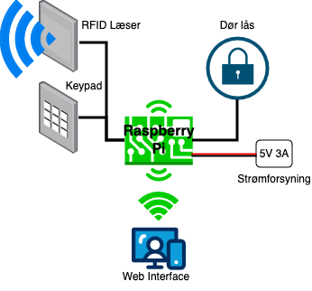
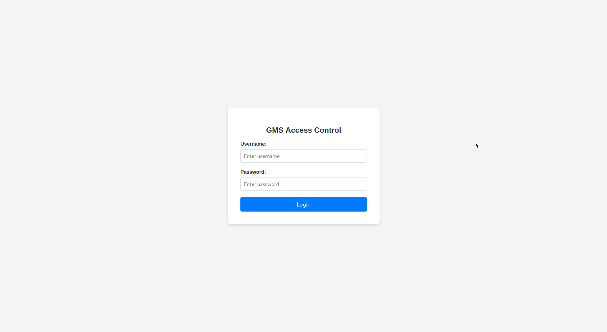
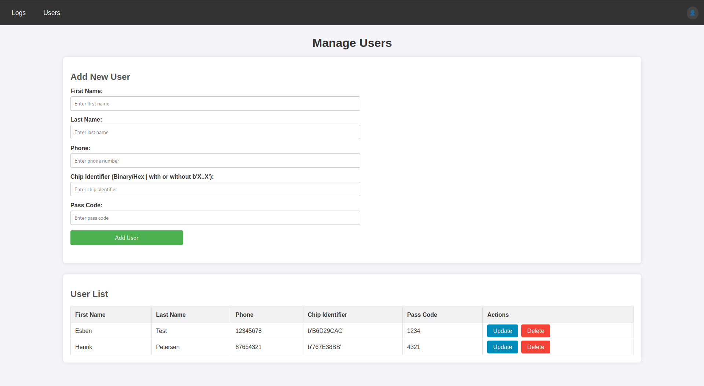
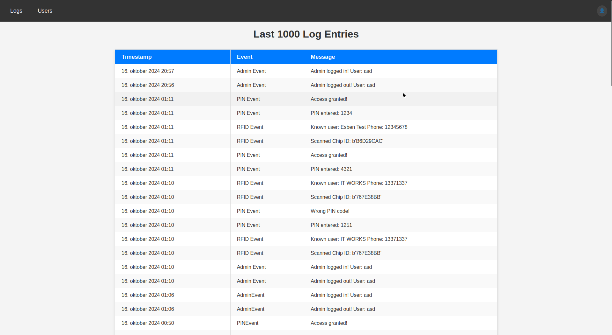

# Green Makerspace | AccessControl
This is the repo of the access control system for Green Makerspace in Sønderborg, Denmark.  
It features an RFID chip reader and a keypad for inputting access codes.

## System diagram

  

 

## Datasheets
84LS Keypad  
[https://www.digikey.com.mx/htmldatasheets/production/868043/0/0/1/84LS-Series-Datasheet.pdf](https://www.digikey.com.mx/htmldatasheets/production/868043/0/0/1/84LS-Series-Datasheet.pdf)

MFRC522 RFID Module  
[https://mm.digikey.com/Volume0/opasdata/d220001/medias/docus/5531/4411_CN0090%20other%20related%20document%20%281%29.pdf](https://mm.digikey.com/Volume0/opasdata/d220001/medias/docus/5531/4411_CN0090%20other%20related%20document%20%281%29.pdf)

# Install
Setup python virtual environment:	
Run `python -m venv WIenv` from the same directory as this readme.  
Activate virtual environment:
`source WIenv/bin/activate`

Install Django, Daphne, Channels:
`pip install django daphne channels`  

# Usage
Follow Django usage patterns, by running commands with `python manage.py`.
Run development server with `daphne -b 0.0.0.0 -p 8000 WebInterface.asgi:application` 

# UI Showcase

  

  

  

  

  

  

# Credits
Made by Esben Christensen (eldahl) for Green Makerspace / Vedvarende Energi
